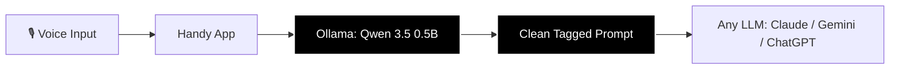

# Prompt Architect for Handy


A local speech-to-text prompt optimizer for [Handy](https://github.com/cjpais/Handy). Converts your rambling voice transcripts into clean, structured LLM prompts — entirely on-device, in under 2 seconds, with zero API costs.

Built for Mac users who use Handy for speech-to-text and want better results when sending prompts to any LLM.

## The Problem

When you use speech-to-text to talk to an LLM, you get something like this:

> "Hey Claude. I'm looking to build a web app. It's a very simple to do app for myself, but I want to make sure that I can easily access it on my GitHub page and have it be easily accessible from anywhere in the world and even my friends and family can go and use it. Use it. You know what I'm saying? Something really cool and clean and very impactful for everybody to go and use, but I want it to be a little bit different. Make sure that it's really impactful and it's really cool and it's not just like any other to do app, you know?"

That's **~145 tokens** of rambling. The LLM has to wade through filler to figure out what you actually want. It often asks clarifying questions or guesses wrong — costing you an extra round-trip and even more tokens.

## The Solution

Prompt Architect post-processes your Handy transcript through a tiny local model and produces this instead:

> [BUILD] Design a simple to-do app for myself from my GitHub page so anyone can access it easily. Outline features, style/technology, target audience, technical details.

That's **~33 tokens**. Same intent, zero filler, clear deliverables. The receiving LLM can act on it immediately with no follow-up questions needed.

**That's a 77% token reduction on a single prompt.** Across real-world testing, Prompt Architect averages a **~74% reduction** in input tokens — your rambling speech gets compressed to roughly 1/4 of its original size while preserving all the important details. If you're using a paid API, that's real money saved on every single interaction.

## How It Works



Handy captures your voice → speech-to-text transcript → Ollama runs a local Qwen 3.5 0.5B model with a custom Modelfile → clean tagged prompt comes out.

The Modelfile contains a tuned system prompt with 6 rules and 6 few-shot examples that teach the model to strip filler, preserve key details, classify intent, and add useful structural scaffolding — all in under 2 seconds on a Mac.

## Quick Start (Mac)

**1. Install Ollama** (if you don't have it already)
```bash
brew install ollama
```
Or download from [ollama.com](https://ollama.com).

**2. Pull the model**
```bash
ollama pull qwen3.5:0.5b
```

**3. Clone this repo and create the custom model**
```bash
git clone https://github.com/MaxSikorski/prompt-architect-handy.git
cd prompt-architect-handy
ollama create prompt-architect-handy -f Modelfile
```

**4. Configure Handy's Post-Processing**

This is the key step. Handy has two separate hotkeys — one for regular transcription and one for transcription *with post-processing*. You need to configure the post-processing settings so Handy knows to run your transcript through the Prompt Architect model.

Open Handy → click the menu bar icon → Settings → scroll down to **Advanced** → **Post-Processing**.

In the post-processing settings:

- Set the **Provider** to `Custom`
- Set the **Model** to `prompt-architect-handy`
- Set the **Prompt** to:
```
Convert this speech transcript into a refined prompt. Output ONLY the tagged instruction, nothing else. Transcript: ${output}
```

**5. Learn the Hotkeys**

This is important — Handy uses **different hotkeys** for regular transcription vs. post-processed transcription:

| Action | Default Hotkey |
|--------|---------------|
| Regular transcription (no optimization) | `Option + Space` |
| **Transcription with Prompt Architect** | **`Option + Shift + Space`** |
| Cancel | `Escape` |

To use Prompt Architect, you must use **`Option + Shift + Space`** (not the regular `Option + Space`). The regular hotkey will just transcribe your speech as-is without running it through the optimizer.

You can remap these shortcuts in Handy's settings if you prefer different key combinations.

**6. Talk naturally**

Press `Option + Shift + Space`, speak into Handy like you normally do — ramble, say "um", say "you know what I'm saying" — then press the hotkey again (or release if using push-to-talk). The system handles the rest and pastes the optimized prompt wherever your cursor is.

## What You Get

Every output follows a consistent structure:

```
[TAG] What to do. Style or constraints. Deliverables the AI should address.
```

The system classifies your intent automatically:

| Tag | When It Fires | You Might Say |
|-----|--------------|---------------|
| `[PLAN]` | You want to think something through before building | "let's figure this out", "planning mode", "not sure yet" |
| `[BUILD]` | You want something created or coded | "make this", "build me a", "create" |
| `[FIX]` | Something existing is broken | "it keeps breaking", "fix this", "stopped working" |
| `[EXPLAIN]` | You want to understand something | "what is", "how does", "break it down for me" |

## Before & After Examples

**Planning a project:**

| | |
|---|---|
| **You say** | "So I want to make a web app for my robotics AI research lab... very Apple aesthetic... not sure what exactly... want it popular and revenue generating... just stick in planning mode and lay out what I need" |
| **You get** | `[PLAN] Design a web app for a robotics AI research lab. Requirements: minimalist Apple-inspired aesthetic, high visual polish, and broad appeal. Outline goals, target audience, feature set, tech stack, and monetization strategy.` |
| **Tokens** | ~113 → ~34 **(70% saved)** |

**Building something:**

| | |
|---|---|
| **You say** | "Make my grandpa's LLM GitHub repo better... so people can run Google Gemini or OpenRouter or local models... help grandparents on old Windows laptops... I'm a Mac user" |
| **You get** | `[BUILD] Optimize the "Grandpa's LLM" GitHub repository for public deployment. Enable support for Google Gemini, OpenRouter, and local models. Focus on a lightweight UI for low-spec Windows laptops to assist elderly users. Ensure macOS cross-compatibility.` |
| **Tokens** | ~177 → ~46 **(74% saved)** |

**Fixing a bug:**

| | |
|---|---|
| **You say** | "My script to check my Voron 3D printers and notify me via Nostr keeps breaking... was working before I updated something... crashes when sending notifications" |
| **You get** | `[FIX] Debug the Python script that monitors Voron 3D printer status and sends completion notifications via the Nostr protocol. The script crashes when attempting to send notifications after a recent update.` |

**Understanding something:**

| | |
|---|---|
| **You say** | "I keep hearing about VL-JEPA from Meta... don't understand what it does or how it works... is it a language model or something different? Break it down for me" |
| **You get** | `[EXPLAIN] What is Meta's VL-JEPA? Explain its architecture, how it differs from standard language models, and why it is significant in current AI research.` |

## Why Qwen 3.5 0.5B?

We tested several models. Here's what we found:

| Model | Speed | Accuracy | Notes |
|-------|-------|----------|-------|
| **Qwen 3.5 0.5B** | **~2 sec** | **~8/10** | **Fast, lightweight, good enough. Recommended.** |
| Qwen 3.5 2B | ~5 min | ~6/10 | Built-in "thinking" mode causes long hangs that can't be reliably disabled. |
| Gemma 4 E2B | ~35 sec | ~9.5/10 | Most accurate, but too slow for a real-time speech workflow. |

The 0.5B model is the sweet spot: fast enough to feel instant, accurate enough that the receiving LLM gets a clear instruction, and light enough to run on any Mac without hogging resources.

**Want higher accuracy and don't mind waiting?** Swap in Gemma 4 E2B by changing the `FROM` line in the Modelfile:
```
FROM gemma4:e2b
```
Then rebuild: `ollama create prompt-architect-handy -f Modelfile`

## Requirements

- **macOS** (tested on Apple Silicon, should work on Intel Macs too)
- **Ollama** ([ollama.com](https://ollama.com))
- **Handy** ([github.com/cjpais/Handy](https://github.com/cjpais/Handy))
- **~500 MB RAM** for the Qwen 3.5 0.5B model

## Customization

**Add new intent tags:** If you frequently do something that doesn't fit the four tags (e.g., `[REVIEW]`, `[COMPARE]`, `[SUMMARIZE]`), add a tag definition and a matching example to the Modelfile.

**Swap in better examples:** The few-shot examples are the main tuning lever. When you find a rambling the model handles poorly, craft the ideal output and replace a weaker example. Keep it to 6-7 examples max to leave context room for the model to process your transcript.

**Try a different model:** Any Ollama-compatible model works. Change the `FROM` line in the Modelfile and rebuild.

## How It Was Built

This system was developed through iterative prompt engineering — no fine-tuning or training involved. The process:

1. Started with a basic system prompt on Qwen 3.5 0.5B → scored 2/10 (multi-tag outputs, hallucinations, chatbot drift)
2. Added strict rules and few-shot examples → improved to 5-6/10
3. Compressed the system prompt by 55% to free context for the model → improved to 7/10
4. Added structural scaffolding pattern and output template → improved to 8/10
5. Tested larger models (Gemma 4 E2B) to validate prompt quality, then brought learnings back to 0.5B
6. Final system: 8/10 accuracy in under 2 seconds

Prompt architecture co-developed with Claude (Anthropic) and Gemini (Google).

## Roadmap

**Model Distillation** — Generate hundreds of input/output pairs using a larger model (Gemma 4 E2B, Claude, Gemini), then fine-tune the Qwen 0.5B on those pairs. This would internalize the prompt patterns directly into the model weights, allowing a smaller system prompt, faster inference, and pushing accuracy from ~8/10 toward 9.5/10 without sacrificing speed.

**Expanded Intent Tags** — Add tags like `[REVIEW]`, `[COMPARE]`, and `[SUMMARIZE]` as real-world usage reveals common speech patterns that don't fit the current four.

**Community Example Library** — Collect real-world ramblings and ideal outputs from Handy users to build a shared dataset of few-shot examples that anyone can swap into their Modelfile.

**Cross-Platform Support** — Test and document setup for Linux and Windows users running Ollama + Handy.

## Community

We'd love to hear how you're using Prompt Architect. Here's how to get involved:

**Share your results** — Tried it out? Open a [Discussion](https://github.com/MaxSikorski/prompt-architect-handy/discussions) and tell us how it's working for you. How many tokens are you saving? What ramblings does it handle well? Before/after comparisons are especially welcome.

**Report failures** — Found a rambling the model fumbles? [Open an issue](https://github.com/MaxSikorski/prompt-architect-handy/issues) with your raw speech-to-text input, what the model output, and what the ideal output should have been. These real-world failures are the most valuable way to improve the system for everyone.

**Contribute examples** — If you've crafted better few-shot examples or found ramblings that could improve the Modelfile, submit a [Pull Request](https://github.com/MaxSikorski/prompt-architect-handy/pulls). To contribute an example, use this format:

```
EXAMPLE:
Input: "<your raw speech-to-text transcript>"
Output: [TAG] <the ideal optimized prompt>
```

Include the raw rambling exactly as your speech-to-text produced it (filler and all) and the cleanest output you think the model should produce. The more diverse the examples — different topics, different intent tags, different speaking styles — the better the model performs for everyone.

**Spread the word** — If Prompt Architect is saving you time and tokens, star the repo and share it with the [Handy community](https://github.com/cjpais/Handy/discussions). The more users testing it, the faster it improves.

## Credits

- [Handy](https://github.com/cjpais/Handy) by CJ Pais — the speech-to-text app that makes this workflow possible
- [Ollama](https://ollama.com) — local model inference
- [Qwen 3.5](https://huggingface.co/Qwen) by Alibaba — the default model
- Prompt architecture co-developed with [Claude](https://claude.ai) (Anthropic) and [Gemini](https://gemini.google.com) (Google)

## License

MIT
